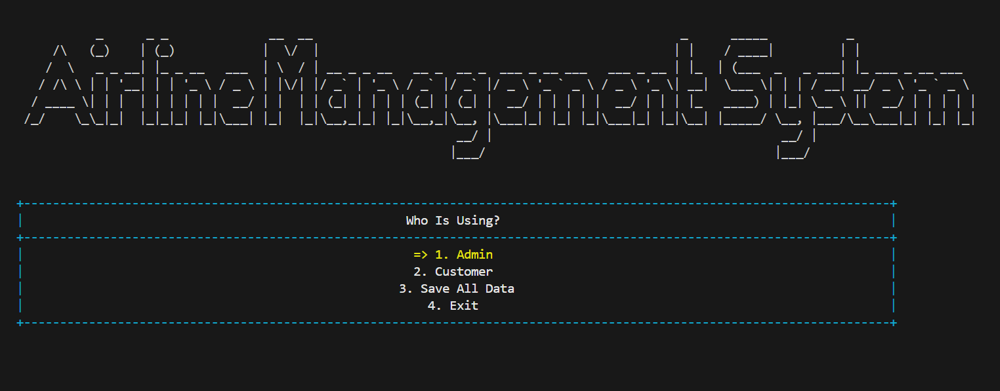
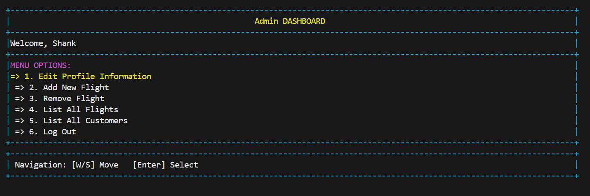
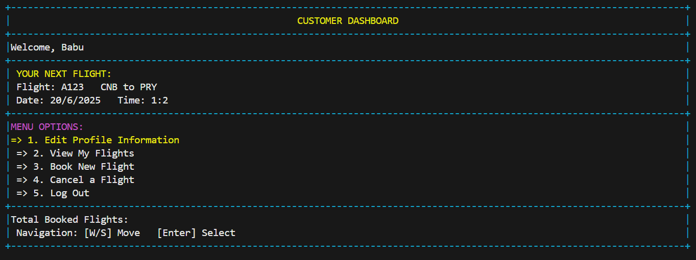
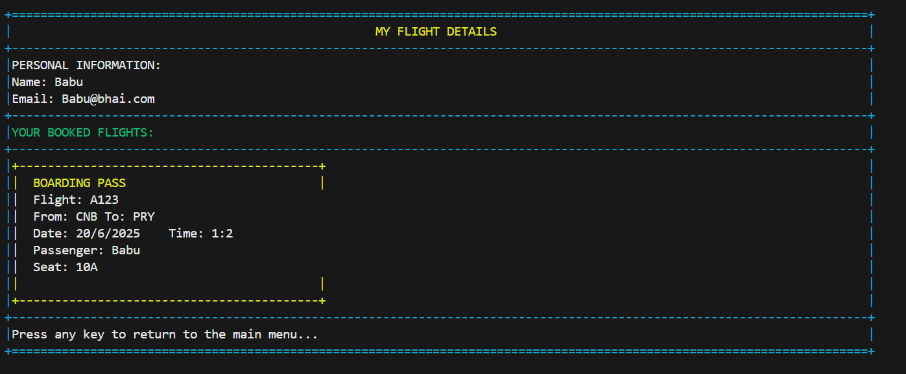
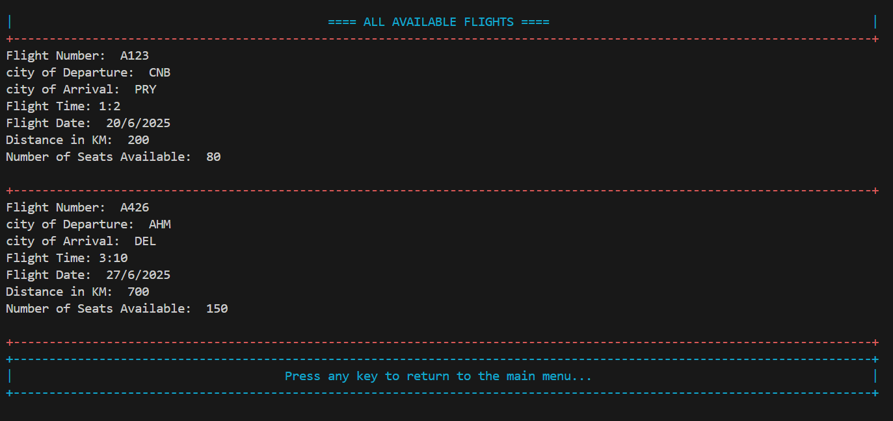

# ✈️ Airline Management System

A command-line-based **Airline Management System** implemented in C++ using **Object-Oriented Programming (OOP)** principles. This semester project allows administrators to manage flights and customers, while users (admins and customers) interact through an intuitive console-based menu system.

---

## 📸 Preview

- 


- 


- 


- 


- 


- 


---

## 📌 Features

### 🛫 Admin Panel
- Add new flights
- Remove existing flights
- View all available flights
- View all registered customers
- Edit admin information

### 🧍‍♂️ Customer Panel
- Book new flights
- Cancel booked flights
- View personal and booking information
- Edit profile details

### ✈️ Flight Management
- View detailed flight information:
  - Flight Number
  - Origin and Destination
  - Date and Time
  - Distance and Available Seats
- Track customers booked on each flight

---

## 🧠 How It Works

### 🧱 Class Architecture
- **`User` (Abstract Base Class)**:
  - Stores common user data: ID, Name, Email, Password
  - Provides credential verification
  - Contains pure virtual function: `userPanel()`
  - Derived by: `Admin` and `Customer`

- **`Admin` (Derived from User)**:
  - Manages system-wide operations (CRUD for flights and customers)
  - Lists all flights and registered users

- **`Customer` (Derived from User)**:
  - Handles flight bookings and cancellations
  - Maintains personal and booking data

- **`Flight`**:
  - Stores flight metadata (number, cities, time, date, seats, distance)
  - Manages customer bookings
  - Supports formatted output via overloaded `<<` operator

---

## 🛠 Tech Stack

| Component        | Technology                            |
|------------------|---------------------------------------|
| **Language**     | C++                                   |
| **Concepts**     | OOP (Inheritance, Polymorphism)       |
| **Interface**    | Console-based menu system             |
| **Storage**      | File handling (under development)     |

---

## ⚙ Setup & Installation

### 📝 Prerequisites
- C++ compiler (e.g., [MinGW](https://www.mingw-w64.org/) with `g++`)
- Command-line interface (CMD, Terminal, or PowerShell)
- Git

### 📁 Clone the Repository
```bash
git clone https://github.com/Cool-Titan/AirlineManagementSystem.git
cd AirlineManagementSystem
```

### 🛠 Compile and Run
1. Compile the source files:
   ```bash
   g++ main.cpp User.cpp Console.cpp FileHelper.cpp Flight.cpp -o AirlineManagement.exe
   ```
2. Run the executable:
   ```bash
   ./AirlineManagement.exe
   ```
   *(On Linux/Mac, use `./AirlineManagement`)*

---

## 📂 Project Structure

```
Airline-Management-System/
├── main.cpp                # Entry point and menu system
├── User.cpp                # User class implementation
├── User.h                  # User class definition
├── ConsoleManipulation.cpp # Console UI utilities
├── ConsoleManipulation.h   # Console UI declarations
├── Flight.cpp              # Flight class implementation
├── Flight.h                # Flight class definition
├── Other_Resources/        # Screenshots and additional assets
│   └── Screenshots/
│       ├── menu.png
│       ├── admin.png
│       ├── customer.png
└── README.md               # Project documentation
```
